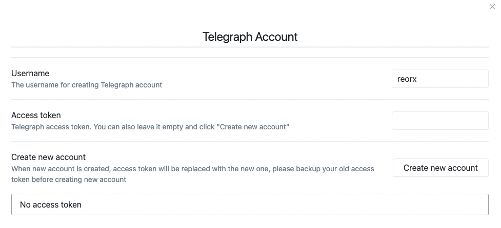
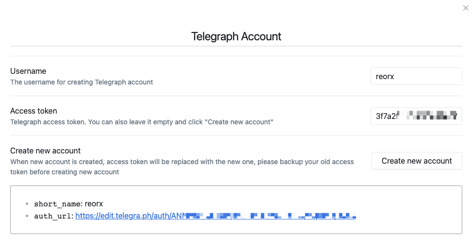
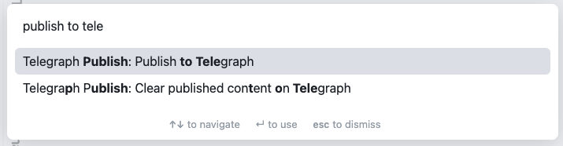
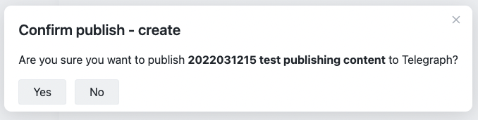
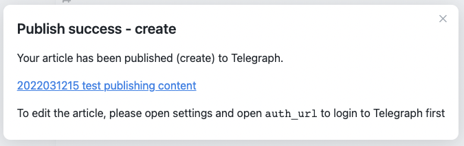
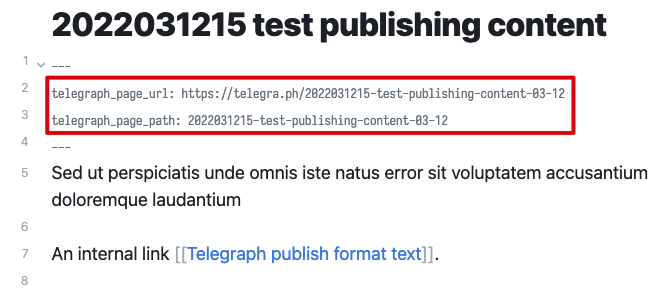
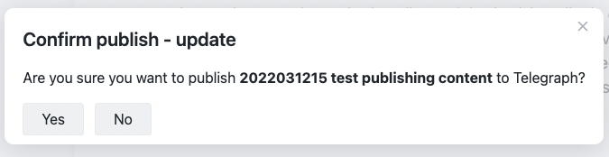
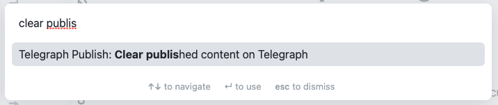
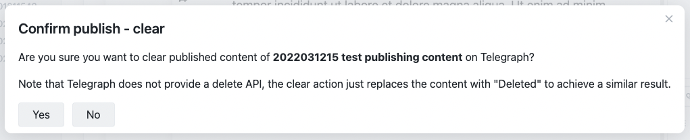
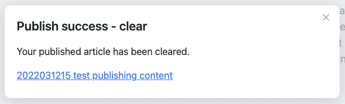

## Obsidian Telegraph Publish

Publish your Obsidian note to a Telegraph page.

Features:
- Publish the active file to a new Telegraph page (create).
- Publish the active file to an existing Telegraph page (update).
- Clear published content of the active file.

Upcoming:
- [ ] Support image uploading.

## Formatting support

Telegraph has restricted support for HTML tags, therefor it's not practical to publish very complicated pages. You can see a [showcase](https://telegra.ph/2022031122-Test-telegraph-publish-02-03-12) of which the [sample note](./sample_note.md) is rendered.

|Markdown Syntax|Support|
|---|---|
|**Inline**| |
|`**bold**`|✔|
|`*italicized*`|✔|
|`code`|✔|
|`~~strike through~~`|x|
|`==highlight==`|x|
|`[external link](/)`|✔|
|`[[internal link]]|Render as external link to `#`|
|`![[embedded image]]`|Plan to support|
|**Block**| |
|`- list`|Nested list will be flattened|
|`> blockquote`|List in blockquote will be separated|
|<code>\`\`\`code block</code>|✔|
|`<table>`|Render as code block|

## How to use

### Create a Telegraph account

Before publishing any pages, you need to create a Telegraph account first.

Open settings of **Telegraph Publish**

You can see **Access token** is empty, click the**Create new account" button, the new account will be created and access token will be filled automatically.

You can click the `auth_url` to authenticate this account in your browser, so that you can edit the published pages later.

### Publish a new page

To publish a new page, first you need to open a markdown file,
then click the sidebar button or run the command called
**"Publish to Telegraph"**.

Click **"Yes"** in the confirm modal: 

Then wait a second, after the page has been successfully created, you will see the Telegraph page URL in the next modal:

Click the URL to open the page in your browser, if you have already authenticated through `auth_url` in settings, you will be able to see the **Edit** button on the right side of the page.

Now go back to the note, and switch to source mode, you can notice that the frontmatter is updated with two new keys: `telegraph_page_url` and `telegraph_page_path`. They are used to keep track of the connection from the note to the Telegraph page.

### Update an existing page

If you have already published a note, you can change its content and simply run **"Publish to Telegraph"** again to update the existing page. The modal will shown as below:

As long as the frontmatter is correct and the access token is unchanged, you can always update the page associated with the new.

### Clear the published content

Since Telegraph does not provide a delete page API, the plugin provides a **Clear published content on Telegraph** command to remove the content of a published page.

After running the command you will see the following modal:

Click **Yes** and wait for the clearing process to finish.

Open the URL again, you will see the content of the page is only a `Deleted` word left.
